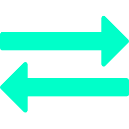

[![Build Status][build-shield]][build-url]
[![Contributors][contributors-shield]][contributors-url]
[![MIT License][license-shield]][license-url]
[![LinkedIn][linkedin-shield]][linkedin-url]


<!-- PROJECT LOGO -->
<br />
<p align="center">
  <a href="https://github.com/kennyworkman/alignment-app">
    
  </a>

  <h3 align="center">Alignment App</h3>

  <p align="center">
   A Flask-based web application for customizable gene alignment 
    <br />
    <a href="https://genealigner.site/"><strong>See hosted app »</strong></a>
    <br />
    <br />
    ·
    <a href="https://github.com/kennyworkman/alignment-app/issues">Report Bug</a>
    ·
    <a href="https://github.com/kennyworkman/alignment-app/issues">Request Feature</a>
    ·
  </p>
</p>


<!-- TABLE OF CONTENTS -->
## Table of Contents

* [About the Project](#about-the-project)
  * [Built With](#built-with)
* [Getting Started](#getting-started)
  * [Prerequisites](#prerequisites)
  * [Installation](#installation)
* [Usage](#usage)
* [Roadmap](#roadmap)
* [Contributing](#contributing)
* [License](#license)
* [Contact](#contact)
* [Acknowledgements](#acknowledgements)


<!-- ABOUT THE PROJECT -->
## About The Project

[![Application Name Screen Shot][application-screenshot]](https://genealigner.site)

There are many great gene aligning services avaialable online, like [BLAST](https://blast.ncbi.nlm.nih.gov), but I found the number of options intimidating as a new bioinformatician. I wanted to create a minimal platform that sacrificed little core functionality, yet made alignment quick and easy.

Here's why:
* There should be one, easy to remember web address for all alignment tasks
* Users shouldn't have to decide amongst confusing settings/buttons to perform simple alignment
* It was good personal practice to build and host a web app from scratch

Of course, the minimalism offered by this app comes at the cost of complexity. Check out some alternative tools in the acknolwedgements.

### Built With
The bulk of this application is built on Flask, a lightweight Python framework that conforms to the WSGI server specification (Makes it easy to host with services such as Gunicorn and NGINX).

Most frontend components were pulled straight from bootstrap, and the alignment functionality was outsourced from a Clustal binary.

* [Flask](http://flask.pocoo.org)
* [Bootstrap](https://getbootstrap.com)
* [Clustal Omega](http://www.clustal.org/omega/)


<!-- GETTING STARTED -->
## Getting Started

Want to run the app on your machine?
To get a local copy up and running follow these simple example steps.

### Prerequisites

You'll need the following things to get started:
* python 3.7
* virtualenv
* virtualenvwrapper
* clustalo 
```sh
pip install virtualenv virtualenvwrapper
```
Grab your Clustal Omega binary (clustal) [here](http://www.clustal.org/omega/)
(**Make sure you configure your Clustal Omega path in the clustalo_align module!**)

### Installation

1. Set up your environment with virtualenvwrapper
```sh
mkvirtualenv alignmentenv
workon alignmentenv
```
2. Clone the repo
```sh
git clone https://github.com/kennyworkman/alignment-app
cd alignment-app
```
3. Install Python dependencies
```sh
pip install -r requirements.txt
```
4. Initialize SQLite Databse
```sh
flask init-db
```
5. Run the app locally! (Go to localhost:5000 in your browser to see it)
```sh
flask run
```

<!-- USAGE EXAMPLES -->
## Usage

I tried to make the user interface as self-explanatory as I could. Just enter a pair of genes and hit align! That's all there is to it. 

Additional genes can be added easily after you've aligned your first two, and settings can be found in an adjacent tab.


<!-- ROADMAP -->
## Roadmap

Really looking to improve the user experience as long as new features don't get in the way of ease of use. Remember, [BLAST](https://blast.ncbi.nlm.nih.gov) does what this app does and much better! As long as you're comfortable with the tool and know where to click.

Please [contribute](#contributing)!

See the [open issues]( https://github.com/kennyworkman/alignment-app/issues) for a list of proposed features (and known issues).


<!-- CONTRIBUTING -->
## Contributing

Contributions are what make the open source community such an amazing place to be learn, inspire, and create. Any contributions you make are **greatly appreciated**.

1. Fork the Project
2. Create your Feature Branch (`git checkout -b feature/AmazingFeature`)
3. Commit your Changes (`git commit -m 'Add some AmazingFeature'`)
4. Push to the Branch (`git push origin feature/AmazingFeature`)
5. Open a Pull Request


<!-- LICENSE -->
## License

Distributed under the MIT License. See `LICENSE` for more information.


<!-- CONTACT -->
## Contact

Kenny Workman - kennybworkman@gmail.com

Project Link - [https://github.com/kennyworkman/alignment-app](https://github.com/kennyworkman/alignment-app)


<!-- ACKNOWLEDGEMENTS -->
## Acknowledgements
Some additional alignment tools.
* [NCBI BLAST](https://blast.ncbi.nlm.nih.gov/Blast.cgi)
* [EBI Align](https://www.ebi.ac.uk/Tools/psa)


<!-- MARKDOWN LINKS & IMAGES -->
<!-- https://www.markdownguide.org/basic-syntax/#reference-style-links -->
[build-shield]: https://img.shields.io/badge/build-passing-brightgreen.svg?style=flat-square
[build-url]: #
[contributors-shield]: https://img.shields.io/badge/contributors-1-orange.svg?style=flat-square
[contributors-url]: https://github.com/kennyworkman/alignment-app/graphs/contributors
[license-shield]: https://img.shields.io/badge/license-MIT-blue.svg?style=flat-square
[license-url]: https://choosealicense.com/licenses/mit
[linkedin-shield]: https://img.shields.io/badge/-LinkedIn-black.svg?style=flat-square&logo=linkedin&colorB=555
[linkedin-url]: https://www.linkedin.com/in/kenny-workman-11151115a/
[application-screenshot]: https://github.com/kennyworkman/alignment-app/blob/master/screen_shot.png
